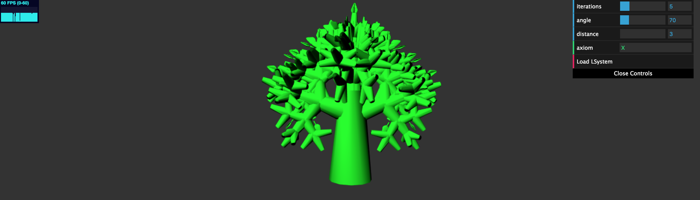

# Homework 4: L-systems

Please note you need to press "Load LSystem" in the GUI for the changes to take place.

Explanation of code:
-  Interactivity: Can change axiom, angle of rotation of turtle, distance translated (length), and number of iterations for parsing the lsystem grammar (note, gets slow around 5+ iterations)
- Rules:
    - F = move forward, draw a branch
    - '+' = turn right
    - '-' = turn left
    - & = pitch down
    - ^ = pitch up
    - < = rotate left
    - '>' = rotate right
    - [ = push turtle onto stack
    - ] = pop turtle from stack
    -* = draw a leaf
- branches are cylinder like meshes, leaves are a leaf like mesh
-  From the GUI, input the initial axiom. The default is just X, with 1 iteration, which produces a single branch.
- Change the axiom with the above rules to generate a tree, or, keep axiom as X and increase iterations to grow a tree
- For each iteration, the input axiom string is expanded based on the following rules:
    - Every time it reads an X, replace with F
    - Every time it reads an F, 1/3 of the time replace F with "F[&-F][+F][<F][>F][F*]", 1/3 of the time replace F with "F[^<F][>F][-F][+F][F*]", and 1/3 of the time replace F with "F[^<F][>F][-F][+F][F*]"
- To construct my tree, a stack of "turtle states" is maintained. Each turtle keeps track of its current position and orientation. Orientation is represented by a quaternion. Each time the turtle rotates, the current orientation is multiplied by a rotation quaternion representing the given rotation. This allows the turtle to accumulate all rotations. When the turtle is told to move forward and draw a branch or leaf, the orientation quaternion is applied to a "direction" vector (as in, the direction vector is what is rotated). The turtle then moves along the vector by a distance given by the user input, and this is returned as the turtle's current updated position.
